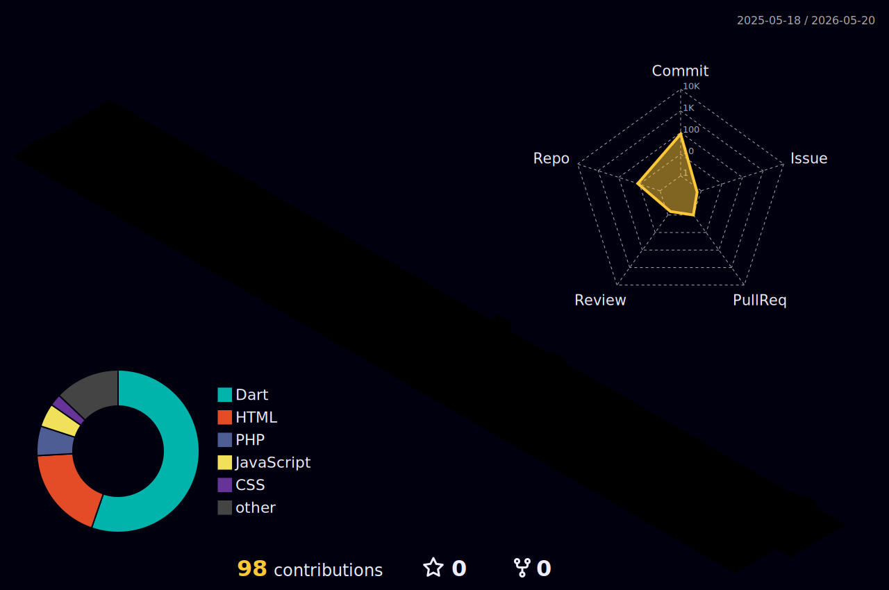

<!-- ================= HEADER BANNER ================= -->

  

<!-- ================= TYPING SVG ================= -->

<h1 align="center">Hi 👋, I'm Vickry</h1>

  

  

---

<!-- ================= CONNECT ================= -->

<h3 align="center">🚀 Connect With Me</h3>

  

---

<!-- ================= TECH STACK ================= -->

<h3 align="center">🛠 Languages & Tools</h3>

  

  

  

---
<!-- ================= STREAK ================= -->

<h3 align="center">🔥 GitHub Streak</h3>

  

---

<!-- ================= DEV QUOTE ================= -->

<h3 align="center">💭 Random Dev Quote</h3>

  

---

<!-- ================= HOLPIN BADGE ================= -->

<h3 align="center">🎖 Holopin Badges</h3>

  

---

<!-- ================= SNAKE ================= -->

<h3 align="center">🐍 Contribution Snake</h3>

  

---

<!-- ================= 3D CONTRIBUTION ================= -->

<h3 align="center">🌌 3D Contribution</h3>

  

---

  ✨ Always learning new technologies and building cool projects ✨

---
<!-- ================= FOOTER ================= -->

  

